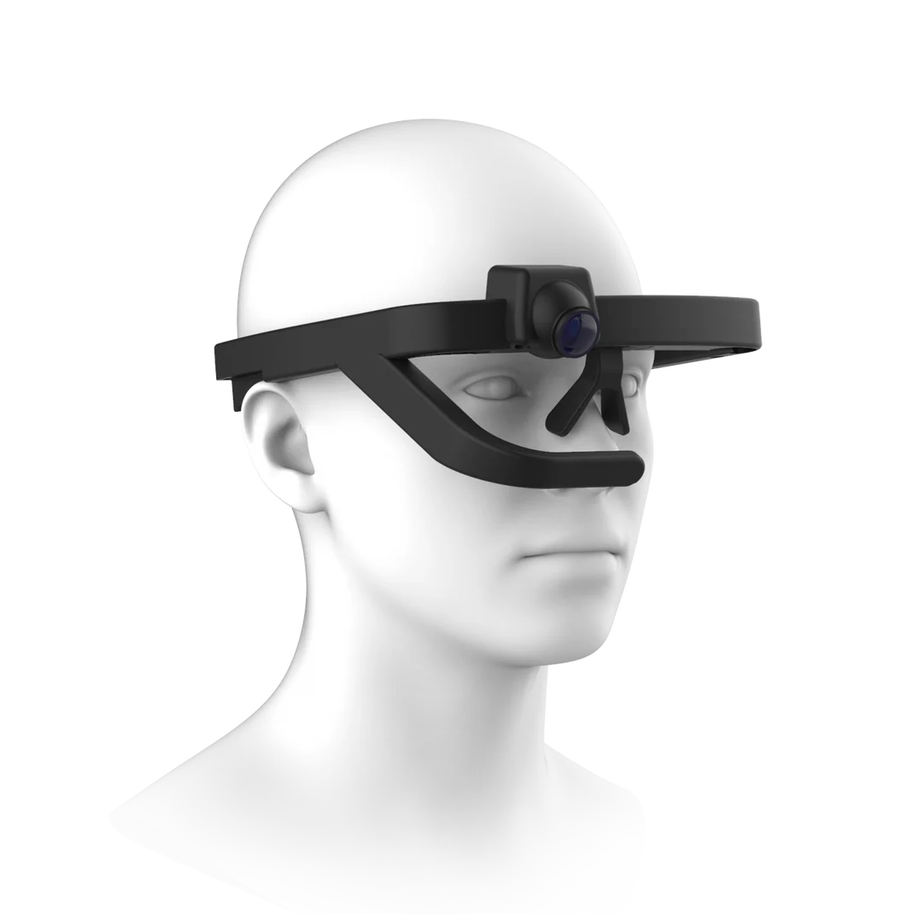

[](https://codecov.io/gh/kexxu-robotics/KexxuEye-Python-SDK)


KexxuEye Python SDK
===

To be used with the Kexxu eye tracking glasses available on [kexxu.com](https://kexxu.com).

Install with (python>=3.7):

```
pip install git+https://github.com/kexxu-robotics/KexxuEye-Python-SDK.git
```



The Kexxu eye tracker has a device id, like:

```
openeye-v4-abcd1234
```

It can be found on a local network with its hostname built op from its device id, like:

```
openeye-v4-abcd1234.local
```

Real time eye tracking data is available over MQTT.

The list of recordings and the files of the recordings of the device are available on http.


